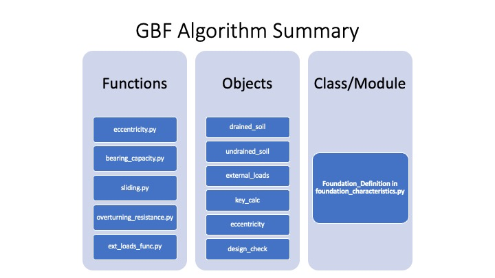

# Gravity Based Foundation Modelling
Gravity based foundation (GBF) module of the Selkie Project makes use of classical object oriented programing approach. Several different functions, seperately written, feed into the main class as pythonic descriptors (descriptors is an attribute of Python that can be viewed in more detail using Python's own documentation.) 

Fig. 1 shows the different functions which are also the objects within the main class. The figure provides a description of the functions that make up the class. Each function within the class provides furhter description about their utility, inputs and outputs. They are also highlighted in this documentation.  

Included within the documentation is a designer script which provides the user a sample script deploying the current algorithm. The user, without jumping into the code or its details, can simply alter the input parameters stated in the designer script. Care has to be taken about ensuring unit similarity, otherwise, the code will not function as desired. The default units for each input parameter is stated in the designer script and in each individual class object. Furthermore, a detailed breakdown of the inputs, outputs and their respective units, datatypes are explained in this document as well. 

